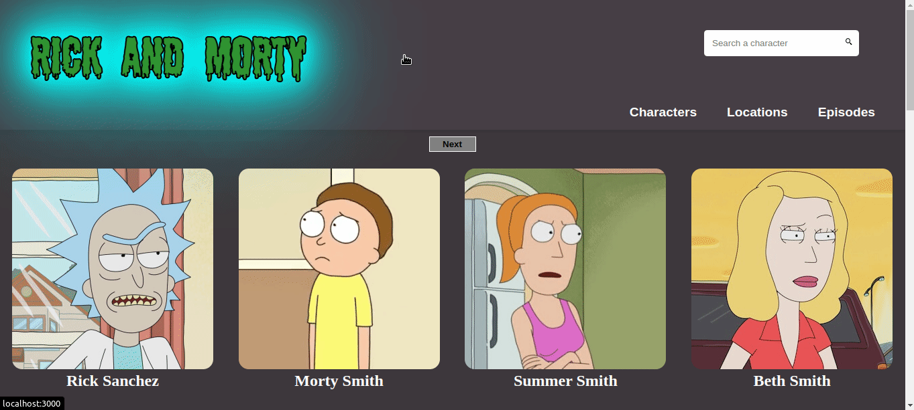
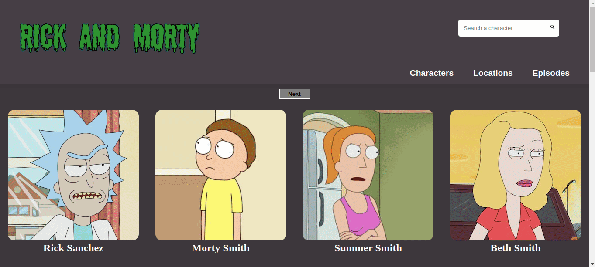

    

<h2>Rick and Morty</h2>

Este projeto foi desenvolvido em React utilizando a API pública do <a href="https://rickandmortyapi.com/">Rick and Morty</a>, para o roteamento das páginas foi utilizada a biblioteca React Router Dom.

Neste projeto é possível obter informações sobre as personagens da série, locais e episódios, é possível também buscar pelas personagens.

    <h6>Tela inicial mostrando as personagens, utilizando a navbar para acessar a págna de episódios e locais.</h6>
    

 

    <h6>Informações sobre as personagens, é possível clicar nos locais para obter mais informações.</h6>
    

 

    <h6>Busca de personagens.</h6>
    

 

    <h6>Paginação para exibição de personagens.</h6>
    

 

Para instalar as dependências do projeto utilize o comando abaixo:

#### `npm install`

Para rodar o projeto utilize o comando abaixo:

#### `npm start`

